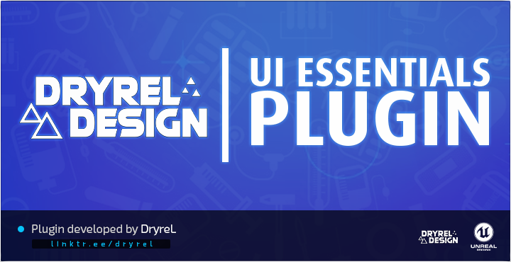
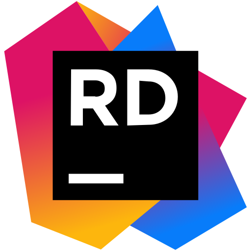

DryreL UI Essentials Demo
=============================

  

> [!IMPORTANT]  
> Developed by [**@DryreL**](https://github.com/dryrel "**@DryreL**").

Description
=============================

A plugin developed to create a more advanced User Interface (UI) in Unreal Engine

Setup Instructions
==================

> [!TIP]
> **Generate Project Files**
> * Right click *DryreLUIEssentials\DryreLUIEssentials.uproject*
> * Select Generate Visual Studio project files
> 
> **Build Project**
> * Open *DryreLUIEssentials\DryreLUIEssentials.sln*
> * Build as *Development_editor-x64*
> * CTRL+F5 to launch unreal editor
> 
> **Verify Plugin**
> * Click *Edit->Plugins* from the main menu
> * Under the installed node find the *DryreL Design* node
> * Confirm the DryreL UI Essentials plugin is *visible* and *enabled*
> * Close the Plugin dialog
>
> **Start the Demo**
> * Run the project by clicking the *Play* button in the toolbar.
> * System Information should display on the screen.

Requirements
==================

For compilation:

> [!IMPORTANT]  
> - Visual Studio C++ 2022 / JetBrains Rider 2022 or greater.
> - Unreal Engine 5.0 or greater.
> -         